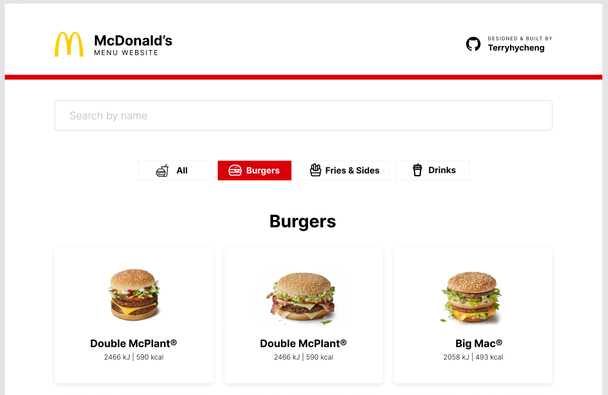

# McDonald's Menu Website

Browse the menu on this fully responsive menu website before ordering in McDonald's!



➡️ UI Design on Figma: [link](https://www.figma.com/file/xOylO8RCruiwouwRfV08mu/McDonald-Food-Website?node-id=0%3A1&t=QHFgSVY3adgv5FAt-1)

## Overview

This is the first mini-project for my [100-days-of-code](https://github.com/terryhycheng/100-days-of-code) challenge. The main focus is to practise front-end development with `ReactJS` and testing framework like `Jest` or `Vitest`, `Testing Library React` and `Cypress`.

**Features:**

- Filter products by categories
- Search a product by its name through the search bar
- Auto-complete while typing in the search bar
- Pop-up modal to display the product details
- Click the 'Show more' button to extend the list of products

## Getting Started

After download the folder, run the following:

```sh
yarn dev
```

## Build with

- ReactJS with Vite
- Vitest
- Testing Library React
